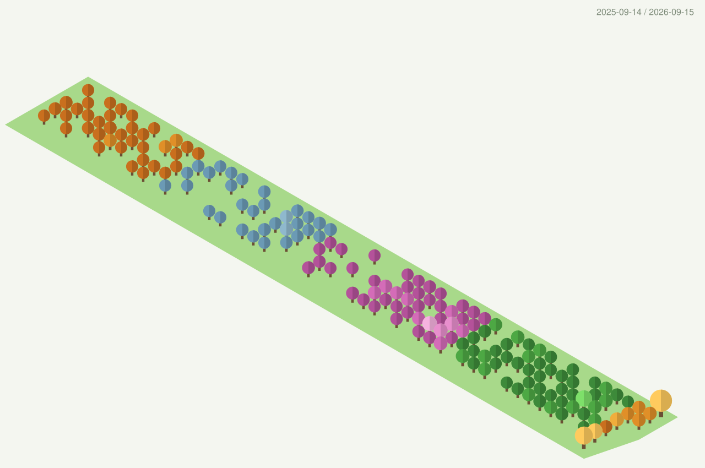
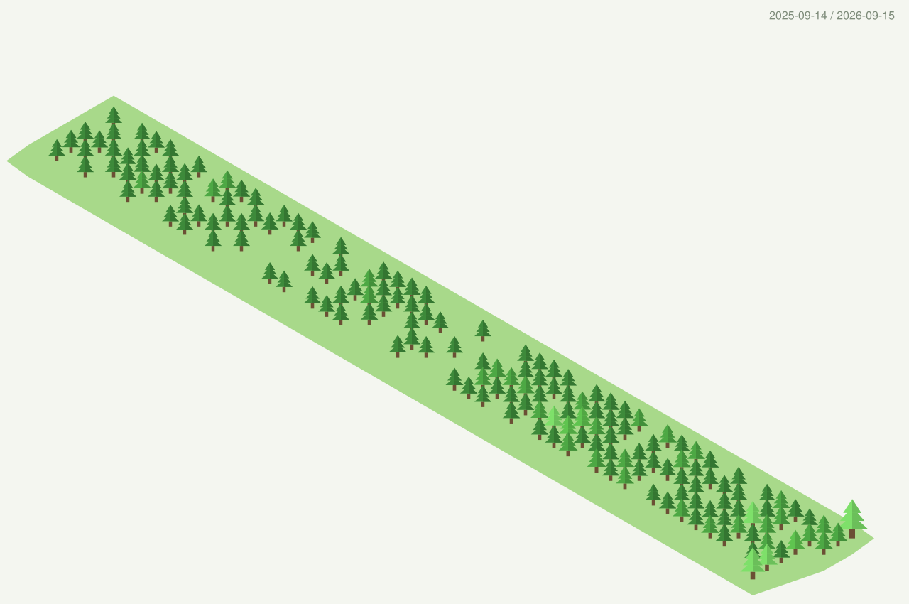
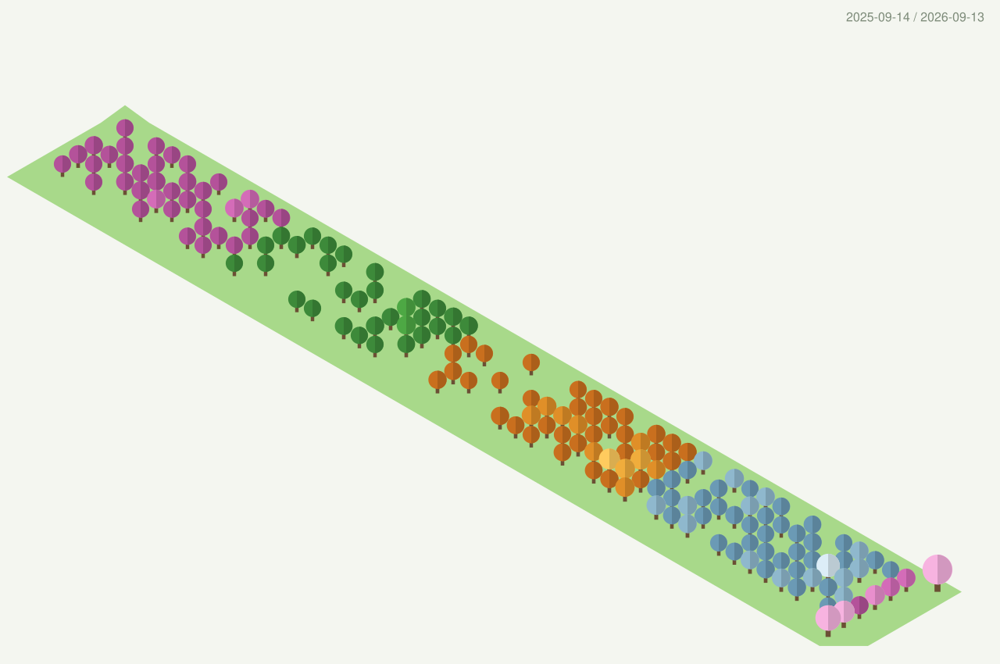

# GitHub Profile 3D Contrib — forest fork



A fork of [yoshi389111/github-profile-3d-contrib](https://github.com/yoshi389111/github-profile-3d-contrib)
that draws your contribution calendar as a **forest** instead of isometric blocks.

All the heavy lifting — the GitHub GraphQL queries, the isometric projection, the
seasonal colour interpolation, the GitHub Action wiring — is the original author's
work. See the [upstream README](https://github.com/yoshi389111/github-profile-3d-contrib#readme)
for the full documentation, every original style and all configuration options.
This fork only adds a new way to draw the calendar.

## What this fork adds

- **Two new types**: `tree` (one palette) and `tree_season` (four seasonal palettes,
  reusing the upstream season interpolation).
- **Two crown shapes**: `pine` and `round`.
- **A continuous ground plane** under the calendar, drawn as a single outline so its
  edges stay straight.
- **`spacing`** to spread the trees apart — the canvas grows with it, so nothing is
  clipped. Useful for very active calendars.
- **`viewAngle`** to change the isometric angle (default `30`).
- Radar chart, language pie and the contribution / star / fork counters are **not
  drawn**, leaving just the calendar.

## Usage

Same as upstream, pointing the action at this fork and passing a settings file:

```yaml
- uses: isabelcan7/github-profile-3d-contrib@v1.0-no-charts
  env:
    GITHUB_TOKEN: ${{ secrets.GITHUB_TOKEN }}
    USERNAME: ${{ github.repository_owner }}
    SETTING_JSON: trees.json
```

See [`sample-settings/trees.json`](sample-settings/trees.json) for a complete example
of all four variants below.

```jsonc
{
  "type": "tree",            // or "tree_season"
  "treeShape": "round",      // or "pine"
  "trunkColor": "#6b4f34",
  "groundColor": "#a8d98a",
  "spacing": 1,              // optional, >1 spreads trees apart
  "viewAngle": 30,           // optional, isometric angle in degrees
  "contribColors": ["#2e6b32", "#3d8a3a", "#4da844", "#5fc44f", "#7ee06a"]
}
```

`tree_season` takes `contribColors1`–`contribColors4` instead of `contribColors`,
one palette per season, exactly like the upstream `season` type.

## Variants

**Round crowns** — `"treeShape": "round"`


**Pines** — `"treeShape": "pine"`



**Seasons, southern hemisphere** — `tree_season` with the palettes shifted half a year



## Building

```sh
npm ci
npm run build   # compiles src/ and bundles dist/index.js
npm test
```

`dist/index.js` is committed, since that is what the action runs.

## License

&copy; 2021 SATO Yoshiyuki. Licensed under the MIT License.

Fork modifications &copy; 2026 Isabel Cantero, same license.
